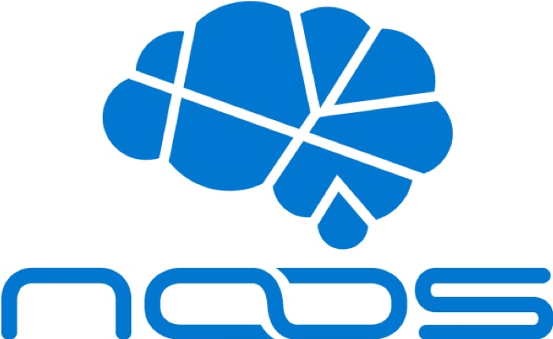
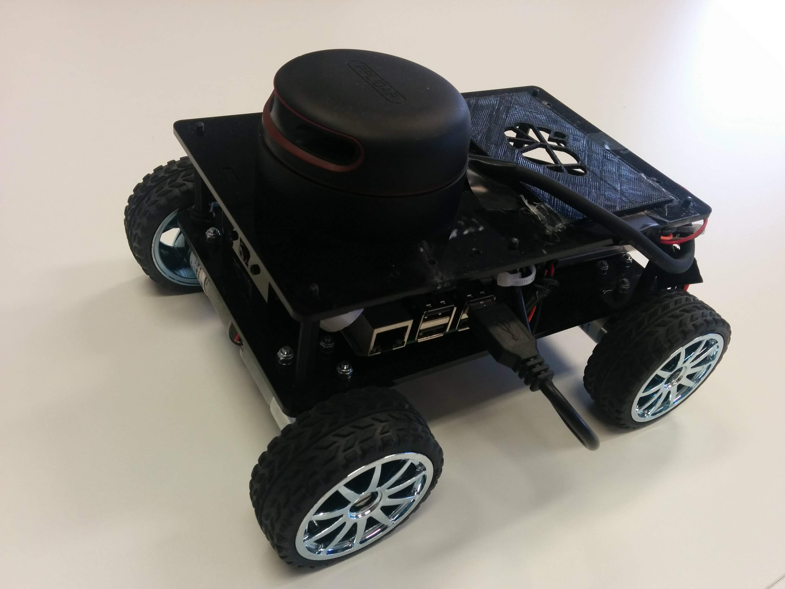

# List of repositories
-------------
List of all the repositories of NoosWare

- [Noos API](#noos-api)
- [Noos API tutorials](#noos-api-tutorials)
- [Noos ROS packages](#noos-ros-packages)
- [Noos ROS tutorials](#noos-ros-tutorials)
- [Noos Python tutorials](#noos-python-tutorials)
- [Noos Javascript tutorials](#noos-javascript-tutorials)
- [Noos Web APP](#noos-web-app)
- [SLAM using Noos and ROS](#ros-slam-example)
- [MARIO robot APP](#mario-app)
- [NAO APP](#nao-vision-example)
- [Human Robot Interface](#human-robot-interface)
- [COZMO APP](#cozmo-app)

_NOTE: The repositories not finished are not included in this list_

## Noos-API

**URL:** [https://github.com/NoosWare/noos-api-cpp](https://github.com/NoosWare/noos-api-cpp)

**Language:** C++

**Description:**

C++ API which gives you access to the Noos platform services. It requires a previous registration in the [noos](https://noos.cloud) webpage. 

Services availables in the platform:

| Human-Robot Interaction | Robot autonomy  | Robot autonomy    |
| ----------------------- | --------------- | ----------------- |
|                         | **Navigation**    | **Computer Vision**   |
|      |    |     |
| Human Detection         | SLAM with LIDAR    | Object Recognition |
| Face Detection          | Create Map         | QR Recognition |
| Face Recognition        | Get Map            | ORB Features |
| Age Detection           | Path Planning      |    |
| Gender Detection        |                    |    |  
| Face Expressions        |                    |    | 
| NLP - Dialogue Systems  |                    |    |    

**Dependencies:**

The following dependencies are required to build the C++ API:

- gcc/g++ >= 4.9
- boost >= 1.58
- cmake >= 2.8
- libssl-dev >= 1.0.1

## Noos-API-tutorials

**URL:** [https://github.com/NoosWare/noos_api_tutorials](https://github.com/NoosWare/noos_api_tutorials)

**Language:** C++

**Description:**

Tutorials for using the Noos Cloud API in C++ from scratch.

**Dependencies:**

- Noos API
- gcc/g++ >= 4.9
- boost >= 1.58
- cmake >= 2.8
- libssl-dev >= 1.0.1

## Noos-ROS-packages

**URL:** [https://github.com/NoosWare/ros_packages_noos_api](https://github.com/NoosWare/ros_packages_noos_api)

**Language:** C++

**Description:**

ROS packages to use the Cloud directly with NOOS. You still can create your own packages as it is explained in [Noos ROS tutorials](#noos-ros-tutorials).

| Packages | 
| ----------------------- | 
| ICP_SLAM
| noos_delete_map |
| Object_recognition |
| ORB       | 
| delete_orb_model          | 
| Face_detection        |
| Vision_batch       |
| Chatbot | 

**Dependencies:**

- ROS (Robot Operative System)
- Noos API
- gcc/g++ >= 4.9
- boost >= 1.58
- cmake >= 2.8
- libssl-dev >= 1.0.1

## Noos-ROS-tutorials

**URL:** [https://github.com/NoosWare/noos_ros_tutorials](https://github.com/NoosWare/noos_ros_tutorials)

**Language:** C++

**Description:**

Tutorials using Noos API with ROS to show the compatibility. It includes examples like `SLAM` using a rover with the `rplidar v2`, how to do a simple `loop` or use a `vision batch` service.

**Dependencies:**

- ROS (Robot Operative System)
- Noos API
- gcc/g++ >= 4.9
- boost >= 1.58
- cmake >= 2.8
- libssl-dev >= 1.0.1

## Noos-Python-tutorials

**URL:** [https://github.com/NoosWare/noos-python-tutorials](https://github.com/NoosWare/noos-python-tutorials) 

**Language:** Python

**Description:**

Tutorials for using the Noos Cloud in case the user is not familiar with C++ language. It is well explained how to configure your environment for using python with this repository.

**Dependencies:**

- pip
- pyenv
- python >= 3.6.5
- opencv-python

## Noos-Javascript-tutorials

**URL:** [https://github.com/NoosWare/noos_javascript_tutorials](https://github.com/NoosWare/noos_javascript_tutorials) 

**Language:** Javascript

**Description:**

Tutorials for using the Noos Cloud in case the user is not familiar with C++ language. It is well explained how to configure your environment for using javascript with this repository.

**Dependencies:**

- nodejs
- npm

## Noos-Web-APP

**URL:** [https://github.com/NoosWare/Noos_Web_APP](https://github.com/NoosWare/Noos_Web_APP)

**Language:** Javascript

**Description:**

Application to use computer vision algorithms on noos (face detection, emotion, age, gender). It is using a NodeJS with a simple web interface using JQuery.

This application was used in the _Innovate UK_ event in 2017. In [this video](https://www.youtube.com/watch?v=itKD7PrtiEU) you'll see how the application works.

**Dependencies:**

- npm
- node js

## Ros-SLAM-example

**URL:** [https://github.com/NoosWare/ros_slam_example](https://github.com/NoosWare/ros_slam_example)

**Language:** C++

**Description:**

It is and example using the rover with the `rplidar v2` and ROS. It is included in the repository [Noos ROS tutorials](#noos-ros-tutorials)

**Dependencies:**

- ROS (Robot Operative System)
- Noos API
- gcc/g++ >= 4.9
- boost >= 1.58
- cmake >= 2.8
- libssl-dev >= 1.0.1

## MARIO-APP

**URL:** [https://github.com/NoosWare/MARIO_APP](https://github.com/NoosWare/MARIO_APP)

**Language:** Javascript

**Description:**

Public application working with the Mario project which illustrates the chatbot with dialogue interactions
and SLAM using waypoints.
[Video demostration](https://www.youtube.com/watch?v=iCGpHmbJnOY)

This application was used in [_Ericsson 5G_](https://www.youtube.com/watch?v=ZjzhbM3MZEM) events around Europe during November 2017.

**Dependencies:**

- ROS (Robot Operative System)
- npm
- node js
- python
- Google Cloud SDK
- repository S2T_win32 (private repository)
- repository human-robot interface
- repository MARIO (private repository)

## NAO-vision-example

**URL:** [https://github.com/NoosWare/nao_vision_example.git](https://github.com/NoosWare/nao_vision_example.git)

**Language:** C++

**Description:**

Application to show NAO robot moving and looking for faces to recognize it and tell the age, gender and expression. 
[Video demostration](https://www.youtube.com/watch?v=P5v-DuxDO68&t=49s)

**Dependencies:**

- Noos API
- naoqi C++ SDK
- gcc/g++ >= 4.9
- boost >= 1.58
- cmake >= 2.8
- libssl-dev >= 1.0.1

## Human-robot-interface

**URL:** [https://github.com/NoosWare/human-robot_interface](https://github.com/NoosWare/human-robot_interface)

**Language:** Python

**Description:**

It connects the Linux PC of MARIO with the Windows PC for doing Speech to Text service through `Google Cloud` or 
`Dragon Natural Speaking` software. It is required to have an account or the license of the software mentioned.
This repository is used for running the [MARIO APP](#mario-app)

**Dependencies:**

- python
- Google Cloud SDK or Dragon NaturalSpeaking
- MARIO repository (private)

## COZMO-APP

**URL:** [https://github.com/NoosWare/COZMO_APP](https://github.com/NoosWare/COZMO_APP)

**Language:** Python

**Description:**

Application to show COZMO using some Computer Vision services like ORB and object recognition. 
Games perfect for kids! It is never too soon for starting to enjoy robots!

**Dependencies:**

- python
- pyenv
- pip
- [COZMO SDK](http://cozmosdk.anki.com/docs/)
- cozmo[camera]
- Pillow 
- requests

